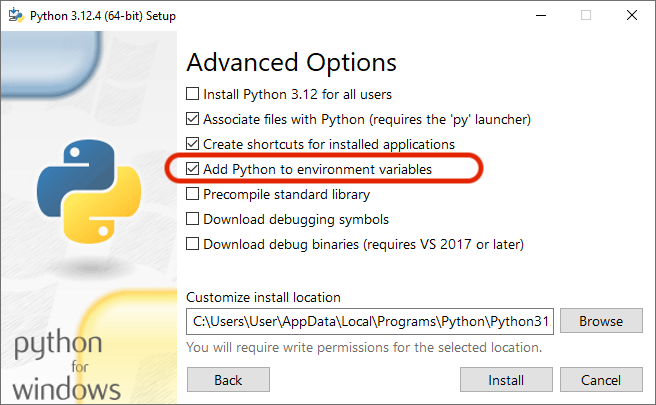

# Image transformations


This repository contains learning materials for Workshop 1 at [IASIM-2024](https://2024.iasim.net), which will take place in Bilbao, 6<sup>th</sup> of July 2024. If you signed up for the workshop, **please read this document carefully and follow the [student's guidelines](#guidelines-for-students)**.

At the workshop I will assume that you:

1. Know basics of math (just a school level).
2. Know a little about programming in general (just vary basic concepts, e.g. loops).
3. Can install and run software on own computer.

Although all exercises are based on Python, no advanced knowledge of this language is required, all details will be given gradually during the workshop.

The activities include several parts (classes). Each class is represented by a [Jupyter notebook](https://jupyter.org), which contains short explanation of the topics of interest, examples of Python code for learning, and place for exercises, where you will write own code in order to solve various problems. There are also several datasets which are necessary for some of the exercises and examples.

## Course activities (classes)

### Class 1. Digital images and numeric arrays

The first class demonstrates how images are represented on computers and other electronic devices, how to generate digital images, how to load and save them from files and capture from cameras. We will also discuss that any image is in fact a numeric array (2D or 3D) and will learn how to deal with such arrays in Python.

Links: [class notebook](class1.ipynb). Estimated time: 60 min.

### Class 2. Geometric transformations

In this class we will discuss transformation of coordinates of pixels and how to implement such geometrical operations as cropping, sampling, flipping, rotation and shearing. First we will discuss how to do it manually, by manipulating the intensity arrays directly. And at the end we will learn how to do it using Python Image Library (PIL/Pillow).

Links: [class notebook](class2.ipynb). Estimated time: 40 min.

### Class 3. Transformation of intensities

The next step is to learn how to change the intensities of the pixels. We will discuss two approaches: pixel wise (when every pixel gets a new intensity based on its value and given mathematical transformation) and neighborhood wise (when intensity of pixel also depends on the intensities of its neighbors). The latter approach is also known as *filtering* or *convolution*. Again we will discuss the basics using manual operations with arrays and then work with more advanced examples in PIL.

Links: [class notebook](class3.ipynb). Estimated time: 40 min.

### Class 4. Working with hyperspectral images

Here we will briefly discuss how to work with hyperspectral images. First of all how to load the images from MATLAB and ENVI files, how to visualize the images and how to make a couple of simple transformations.

Links: [class notebook](class4.ipynb). Estimated time: 20 min.


The time is estimated roughly, the real time will depend on many factors. Even if we do not finish all the classes you will be able to learn the rest yourself by using the provided materials and skills acquired in the first couple of classes.

## Guidelines for students

Here is what you need to do in order to prepare for the workshop:

### 1. Install Python on your computer

**If you already have Python installed, skip this step!**

There are many different ways to do this, the simplest and the most straightforward one is to open the Python website ([https://www.python.org/downloads/](https://www.python.org/downloads/)) in a browser and it will offer you downloading the latest version for your system (Windows or Mac, if you use Linux you know what to do). Just download the installer, run it, and follow the guides on the screen.

It is important (especially if you install it on Windows) to keep the following options selected.

When you run the installer, select *Customize installation*:


In the next dialog keep the default selected options, they should look as follows:


In the next dialog select option to add Python to environment variables (**important**):



After then just continue with all default settings and wait until the installation is done.


### 2. Install VS Code

VS Code is a free software for developing of computer programs on any language, including Python. Simply go to the VS Code website ([https://code.visualstudio.com](https://code.visualstudio.com)) and you will see a large Download button with the latest version suitable for your system. Download the installer, run it, and follow the guides.

### 3. Install Jupyter package

Now you need to install a special library for Python which will let you to use Jupyter notebooks. Jupyter notebook is a simple document, which looks like Word (or rather like a web page) with Python code chunks inside the text. So you can run the code inside the notebook (similar to livescripts in MATLAB and RMarkdown in R). It makes using Python extremely easy.

To install the library just open VS Code that you installed on the previous step. Click on menu *Terminal* and select option *New Terminal*. You will see a small frame appeared in the bottom of the VS Code window and inside this window you can write different commands.

Write the following if you are on Windows:

```
pip install jupyter
```

And if you use Mac run the following:

```
pip3 install jupyter
```

Then press *Enter* on your keyboard and wait. If you do not see any error messages, you can proceed with the last step.


### 4. Install VS Code extensions

You also need to install several extensions which makes VS Code easier to use for this course. You will find a list of extensions with links below. Simply click on the link, it will open a web page with extension, which has a button *Install*. Click on the button and give permission to open it in VS Code (your system will ask you about this). After that, you will get VS Code open with the Extension information inside. Simply click *Install* button there and wait. Then repeat this for the other extensions from the list.

* [Python extension](https://marketplace.visualstudio.com/items?itemName=ms-python.python)
* [Jupyter notebook extension](https://marketplace.visualstudio.com/items?itemName=ms-toolsai.jupyter)

After that, close VS Code and then start it again. Click on *File* menu, select *New File* and then find Jupyter notebook as shown below (your list of file types will be different but Jupyter Notebook should be in the list).


Click on the *Jupyter Notebook* list item and in the new tab you will get an empty notebook with a cell where you can write Python code and run it inside the notebook. Write the following:

```python
import math
r = 10
area = math.sqrt(r * math.pi)

print(f"Area of pizza with radius {r} cm is {area:.2f} squared cm")
```

Then click on a run button on the left side of the cell (looks like a triangle). When you do it first time VS Code will ask you which kernel you want to use. Just select the first option from the provided list (it should be the Python version you have installed).

After that, VS Code will run the code and show you the result. This is how it will look like (I have a typo in my screenshot :):


If it works, then you are almost ready for the course!

If you want to understand what the code does, Google about simple Python code instructions, for example try [this tutorial](https://www.geeksforgeeks.org/python-for-kids/) or [this one](https://kidspython.com/).

### 5. Download the course materials

Finally you need to download an archive (zip-file) with course materials, here is the [direct link](https://github.com/svkucheryavski/iasim-workshop/releases/download/1.0.0/iasim-workshop1-materials.zip). Simply download the archive and unzip it to any folder which you can easily access, for example to Desktop or to Documents (or to any other dedicated folder).

This is it. **If you have troubles with any of the steps just ask me for help.**

